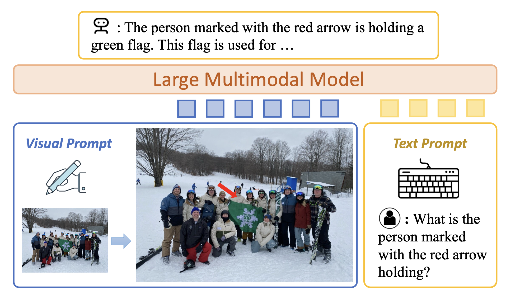
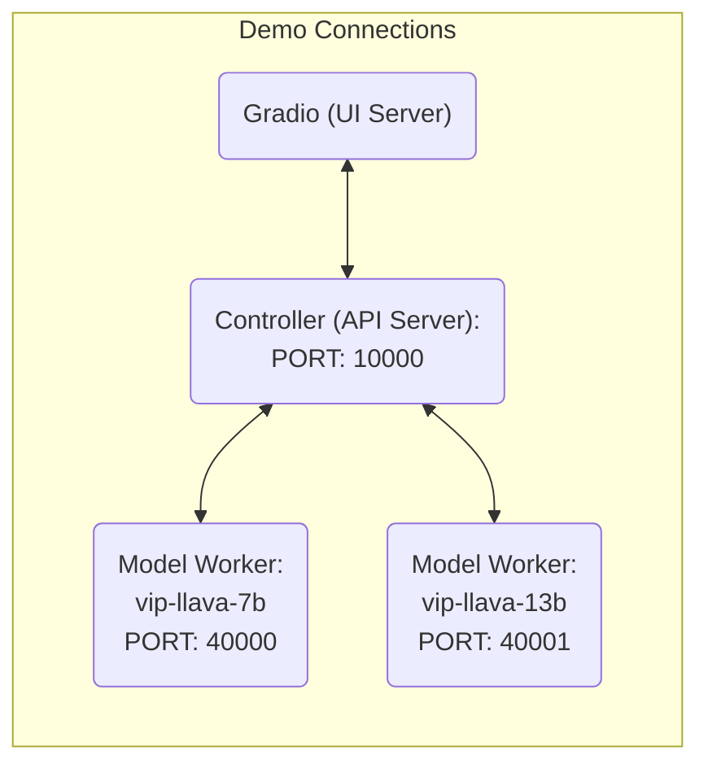

<!-- Copyright 2023 Cruise LLC -->
#  🎯 [CVPR2024] ViP-LLaVA: Making Large Multimodal Models Understand Arbitrary Visual Prompts


[Mu Cai](https://pages.cs.wisc.edu/~mucai/), [Haotian Liu](https://hliu.cc), [Siva Karthik Mustikovela](https://sivakm.github.io/), [Gregory P. Meyer](https://gregmeyer.info), [Yuning Chai](https://scholar.google.com/citations?user=i7U4YogAAAAJ&hl=en), [Dennis Park](https://scholar.google.com/citations?user=_UJsz3AAAAAJ&hl=en), [Yong Jae Lee](https://pages.cs.wisc.edu/~yongjaelee/)


**Approach:** [[Project Page](https://vip-llava.github.io/)] [[Demo](https://pages.cs.wisc.edu/~mucai/vip-llava.html)] [[Model Zoo](https://github.com/mu-cai/ViP-LLaVA/blob/main/docs/MODEL_ZOO.md)] [[Paper](https://arxiv.org/abs/2312.00784)] 

**ViP-Bench:** [[Download Dataset]](https://huggingface.co/datasets/mucai/ViP-Bench) [[LeaderBoard]](https://paperswithcode.com/sota/visual-question-answering-on-vip-bench) [[Evaluation Server]](https://huggingface.co/spaces/mucai/ViP-Bench_Evaluator)




## Release

- [04/26] 🔥 LLaVA and ViP-LLaVA with the recent Llama-3-8B and Phi-3-mini-3.8B LLM backbones is available [here](https://github.com/mu-cai/ViP-LLaVA/blob/main/docs/study_llm_backbone.md)! 
- [02/26] 🔥 ViP-LLaVA is accepted to CVPR 2024!
- [12/13] 🔥 Our works now appears on the official Huggingface [transformers doc](https://huggingface.co/docs/transformers/main/en/model_doc/vipllava)!
- [12/03] 🔥 We released **ViP-LLaVA: Making Large Multimodal Models Understand Arbitrary Visual Prompts**. We propose to directly overlay the visual prompts upon the the original image during visual instruction tunning, so that large multimodal models could possibly understand arbitrary visual prompts in a user-friendly way.  Checkout the [paper](https://arxiv.org/abs/2312.00784) and [demo](https://pages.cs.wisc.edu/~mucai/vip-llava.html). We also built the first zero-shot region-level benchmark **ViP-Bench** for large multimodal models.


[](https://github.com/tatsu-lab/stanford_alpaca/blob/main/LICENSE)
[](https://github.com/tatsu-lab/stanford_alpaca/blob/main/DATA_LICENSE)
**Usage and License Notices**: The data and checkpoint is intended and licensed for research use only. They are also restricted to uses that follow the license agreement of LLaMA, Vicuna and GPT-4. The dataset is CC BY NC 4.0 (allowing only non-commercial use) and models trained using the dataset should not be used outside of research purposes.


## Contents
- [Install](#install)
- [ViP-LLaVA Weights](#vip-llava-weights)
- [Demo](#Demo)
- [Model Zoo](https://github.com/mu-cai/ViP-LLaVA/blob/main/docs/MODEL_ZOO.md)
- [Dataset](https://github.com/mu-cai/ViP-LLaVA/blob/main/docs/Data.md)
- [Train](#train)
- [Evaluation](#evaluation)


## Install

If you are not using Linux, do *NOT* proceed, see instructions for [macOS](https://github.com/mu-cai/ViP-LLaVA/blob/main/docs/macOS.md) and [Windows](https://github.com/mu-cai/ViP-LLaVA/blob/main/docs/Windows.md).

1. Clone this repository and navigate to ViP-LLaVA folder
```bash
cd ViP-LLaVA
```

2. Install Package
```Shell
conda create -n vip-llava python=3.10 -y
conda activate vip-llava
pip install --upgrade pip  # enable PEP 660 support
pip install -e .
```

3. Install additional packages for training cases
```
pip install -e ".[train]"
pip install flash-attn --no-build-isolation
```


### Quick Start With HuggingFace

<details>
<summary>Example Code</summary>

```Python
from llava.model.builder import load_pretrained_model
from llava.mm_utils import get_model_name_from_path
from llava.eval.run_llava import eval_model

model_path = "mucai/vip-llava-7b"
prompt = "What is shown within the pointed region?"
image_file = "https://pages.cs.wisc.edu/~mucai/man-cross-street.jpg"

args = type('Args', (), {
    "model_path": model_path,
    "model_name": get_model_name_from_path(model_path),
    "query": prompt,
    "image_file": image_file,
    "conv_mode": None, "model_base": None, "temperature": 0.2, "top_p": None, "num_beams": 1, "max_new_tokens": 512, "sep": ",",
})()

eval_model(args)
```

Check out the details wth the `load_pretrained_model` function in `llava/model/builder.py`.

You can also use the `eval_model` function in `llava/eval/run_llava.py` to get the output easily. By doing so, you can use this code on Colab directly after downloading this repository.

</details>

## ViP-LLaVA Weights
Please check out our [Model Zoo](https://github.com/mu-cai/ViP-LLaVA/blob/main/docs/MODEL_ZOO.md) for all public ViP-LLaVA checkpoints, and the instructions of how to use the weights.

## Demo

To run our demo, you need to prepare LLaVA checkpoints locally.  Please follow the instructions [here](#vip-llava-weights) to download the checkpoints.


### Gradio Web UI

To launch a Gradio demo locally, please run the following commands one by one. If you plan to launch multiple model workers to compare between different checkpoints, you only need to launch the controller and the web server *ONCE*.




#### Launch a controller
```Shell
python -m llava.serve.controller --host 0.0.0.0 --port 10000
```

#### Launch a gradio web server.
```Shell
python -m llava.serve.gradio_web_server --controller http://localhost:10000 --model-list-mode reload
```
You just launched the Gradio web interface. Now, you can open the web interface with the URL printed on the screen. You may notice that there is no model in the model list. Do not worry, as we have not launched any model worker yet. It will be automatically updated when you launch a model worker.

#### Launch a model worker

This is the actual *worker* that performs the inference on the GPU.  Each worker is responsible for a single model specified in `--model-path`.

```Shell
python -m llava.serve.model_worker --host 0.0.0.0 --controller http://localhost:10000 --port 40000 --worker http://localhost:40000 --model-path mucai/vip-llava-13b
```
Wait until the process finishes loading the model and you see "Uvicorn running on ...".  Now, refresh your Gradio web UI, and you will see the model you just launched in the model list.

You can launch as many workers as you want, and compare between different model checkpoints in the same Gradio interface. Please keep the `--controller` the same, and modify the `--port` and `--worker` to a different port number for each worker.
```Shell
python -m llava.serve.model_worker --host 0.0.0.0 --controller http://localhost:10000 --port <different from 40000, say 40001> --worker http://localhost:<change accordingly, i.e. 40001> --model-path <ckpt2>
```

If you are using an Apple device with an M1 or M2 chip, you can specify the mps device by using the `--device` flag: `--device mps`.

#### Launch a model worker (Multiple GPUs, when GPU VRAM <= 24GB)

If the VRAM of your GPU is less than 24GB (e.g., RTX 3090, RTX 4090, etc.), you may try running it with multiple GPUs. Our latest code base will automatically try to use multiple GPUs if you have more than one GPU. You can specify which GPUs to use with `CUDA_VISIBLE_DEVICES`. Below is an example of running with the first two GPUs.

```Shell
CUDA_VISIBLE_DEVICES=0,1 python -m llava.serve.model_worker --host 0.0.0.0 --controller http://localhost:10000 --port 40000 --worker http://localhost:40000 --model-path mucai/vip-llava-13b
```

#### Launch a model worker (4-bit, 8-bit inference, quantized)

You can launch the model worker with quantized bits (4-bit, 8-bit), which allows you to run the inference with reduced GPU memory footprint, potentially allowing you to run on a GPU with as few as 12GB VRAM. Note that inference with quantized bits may not be as accurate as the full-precision model. Simply append `--load-4bit` or `--load-8bit` to the **model worker** command that you are executing. Below is an example of running with 4-bit quantization.

```Shell
python -m llava.serve.model_worker --host 0.0.0.0 --controller http://localhost:10000 --port 40000 --worker http://localhost:40000 --model-path mucai/vip-llava-13b --load-4bit
```

### CLI Inference

Chat about images using ViP-LLaVA without the need of Gradio interface. It also supports multiple GPUs, 4-bit and 8-bit quantized inference. With 4-bit quantization, for our ViP-LLaVA-7B, it uses less than 8GB VRAM on a single GPU.

```Shell
python -m llava.serve.cli \
    --model-path mucai/vip-llava-7b \
    --image-file "https://pages.cs.wisc.edu/~mucai/man-cross-street.jpg" \
    --load-4bit
```

Or use the bounding box 

```Shell
python -m llava.serve.cli_vip --model-path ./checkpoints/vip-llava-7b --image-file "https://pages.cs.wisc.edu/~mucai/example_styletransfer.png"  --bbox=100,200,200,300
```


## Train


ViP-LLaVA training consists of three stages: (1) feature alignment stage: use our 558K subset of the LAION-CC-SBU dataset to connect a *frozen pretrained* vision encoder to a *frozen LLM*; (2) visual instruction tuning stage: 665K image-level instruction data from LLaVA-1.5 and 520K region-level instruction data using visual prompts. (3) finetuning on GPT-4V data. 

LLaVA is trained on 8 A100 GPUs with 80GB memory. To train on fewer GPUs, you can reduce the `per_device_train_batch_size` and increase the `gradient_accumulation_steps` accordingly. Always keep the global batch size the same: `per_device_train_batch_size` x `gradient_accumulation_steps` x `num_gpus`.

### Hyperparameters
We use a similar set of hyperparameters as Vicuna in finetuning.  Both hyperparameters used in pretraining and finetuning are provided below.

1. Pretraining

| Hyperparameter | Global Batch Size | Learning rate | Epochs | Max length | Weight decay |
| --- | ---: | ---: | ---: | ---: | ---: |
|  ViP-LLaVA-13B | 256 | 1e-3 | 1 | 2048 | 0 |

2. Finetuning

| Hyperparameter | Global Batch Size | Learning rate | Epochs | Max length | Weight decay |
| --- | ---: | ---: | ---: | ---: | ---: |
|  ViP-LLaVA-13B | 128 | 2e-5 | 1 | 2048 | 0 |

### Download Vicuna checkpoints (automatically)

Our base model Vicuna v1.5, which is an instruction-tuned chatbot, will be downloaded automatically when you run our provided training scripts. No action is needed.

### Pretrain (feature alignment)

Please download the 558K subset of the LAION-CC-SBU dataset with BLIP captions we use in the paper [here](https://huggingface.co/datasets/liuhaotian/LLaVA-Pretrain).

Pretrain takes around 5.5 hours for ViP-LLaVA-13B on 8x A100 (80G). It takes around 3.5 hours for  ViP-LLaVA-7B.

Training script with DeepSpeed ZeRO-2: [`pretrain.sh`](https://github.com/mu-cai/ViP-LLaVA/blob/main/scripts/pretrain.sh).

- `--mm_projector_type mlp2x_gelu`: the two-layer MLP vision-language connector.
- `--vision_tower clip_4layers_336`: CLIP ViT-L/14 336px with multilayer feature fusion.

<details>
<summary>Pretraining takes around 20 hours for LLaVA-7B on 8x V100 (32G)</summary>

 We provide training script with DeepSpeed [here](https://github.com/mu-cai/ViP-LLaVA/blob/main/scripts/pretrain_xformers.sh).
Tips:
- If you are using V100 which is not supported by FlashAttention, you can use the [memory-efficient attention](https://arxiv.org/abs/2112.05682) implemented in [xFormers](https://github.com/facebookresearch/xformers). Install xformers and replace `llava/train/train_mem.py` above with [llava/train/train_xformers.py](llava/train/train_xformers.py).
</details>

### Visual Instruction Tuning

1. Prepare data

Please download the annotations of our instruction tuning data in [stage 2](https://huggingface.co/datasets/mucai/ViP-LLaVA-Instruct/blob/main/vip-llava_stage2_mix.json) and [stage 3](https://huggingface.co/datasets/mucai/ViP-LLaVA-Instruct/blob/main/vip-llava_stage3_mix.json). and download the images from constituting datasets:

- COCO: [train2017](http://images.cocodataset.org/zips/train2017.zip)
- GQA: [images](https://downloads.cs.stanford.edu/nlp/data/gqa/images.zip)
- OCR-VQA: [download script](https://drive.google.com/drive/folders/1_GYPY5UkUy7HIcR0zq3ZCFgeZN7BAfm_?usp=sharing), **we save all files as `.jpg`**
- TextVQA: [train_val_images](https://dl.fbaipublicfiles.com/textvqa/images/train_val_images.zip)
- VisualGenome: [part1](https://cs.stanford.edu/people/rak248/VG_100K_2/images.zip), [part2](https://cs.stanford.edu/people/rak248/VG_100K_2/images2.zip)
- Flickr30k: [download here](https://forms.illinois.edu/sec/229675)
- VCR: [download here](https://visualcommonsense.com/download/)
- Visual7W: [download here](http://vision.stanford.edu/yukezhu/visual7w_images.zip)

After downloading all of them, organize the data as follows in `./playground/data`,

```
├── flickr30k-images
├── v7w
├── vcr1images
├── coco
│   └── train2017
├── gqa
│   └── images
├── ocr_vqa
│   └── images
├── textvqa
│   └── train_images
└── vg
    ├── VG_100K
    └── VG_100K_2
```


2. Start training!

You may download our pretrained projectors in [Model Zoo](https://github.com/mu-cai/ViP-LLaVA/blob/main/docs/MODEL_ZOO.md). It is not recommended to use legacy projectors, as they may be trained with a different version of the codebase, and if any option is off, the model will not function/train as we expected.

Visual instruction tuning takes around 40 hours for LLaVA-v1.5-13B on 8x A100 (80G). It takes around 20 hours for LLaVA-v1.5-7B on 8x A100 (40G).

Training script with DeepSpeed ZeRO-2: [`finetune_stage2.sh`](https://github.com/mu-cai/ViP-LLaVA/blob/main/scripts/finetune_stage2.sh). If you further want to use GPT-4V data to enhance the chatting capability, see the training script for stage 3 with DeepSpeed ZeRO-2: [`finetune_stage3.sh`](https://github.com/mu-cai/ViP-LLaVA/blob/main/scripts/finetune_stage3.sh)

If you do not have enough GPU memory:

- Use LoRA: [`finetune_lora.sh`](https://github.com/mu-cai/ViP-LLaVA/blob/main/scripts/finetune_lora.sh). We are able to fit 13B training in 8-A100-40G/8-A6000, and 7B training in 8-RTX3090. Make sure `per_device_train_batch_size*gradient_accumulation_steps` is the same as the provided script for best reproducibility.
- Replace `zero3.json` with `zero3_offload.json` which offloads some parameters to CPU RAM. This slows down the training speed.

If you are interested in finetuning LLaVA model to your own task/data, please check out [`Finetune_Custom_Data.md`](https://github.com/mu-cai/ViP-LLaVA/blob/main/docs/Finetune_Custom_Data.md)。

## Evaluation

ViP-LLaVA is both evaluate on the 4 academic region-level benchmark and the newly proposed **ViP-Bench**. 


See [Evaluation.md](https://github.com/mu-cai/ViP-LLaVA/blob/main/docs/Evaluation.md).


## Citation

If you find ViP-LLaVA useful for your research and applications, please cite using this BibTeX:
```bibtex

@inproceedings{cai2024vipllava,
  author      = {Cai, Mu and Liu, Haotian and Mustikovela,  Siva Karthik and Meyer, Gregory P. and Chai, Yuning and Park, Dennis and Lee, Yong Jae},
  title       = {Making Large Multimodal Models Understand Arbitrary Visual Prompts},
  booktitle   = {IEEE Conference on Computer Vision and Pattern Recognition},
  year        = {2024}
}
```


## Acknowledgement

- [Vicuna](https://github.com/lm-sys/FastChat): the language model we built upon, and our base model Vicuna-13B that has the amazing language capabilities!

- [LLaVa](https://llava-vl.github.io/): the codebase we built upon, which has amazing multimodal abilities! 


