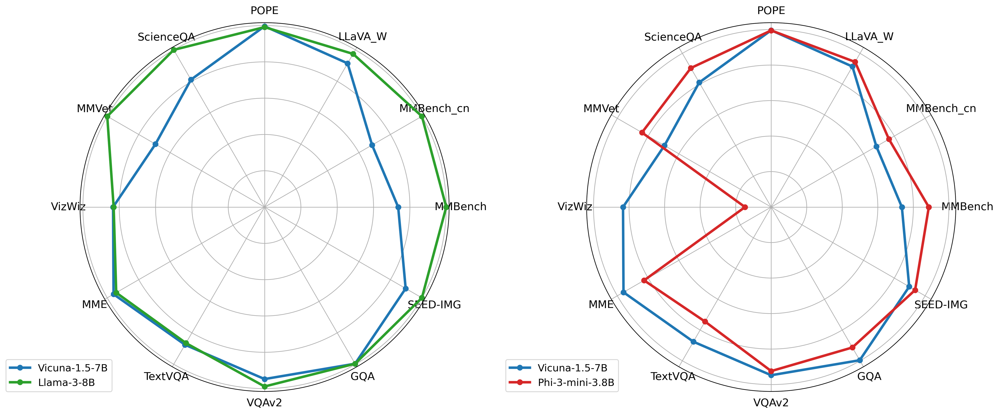
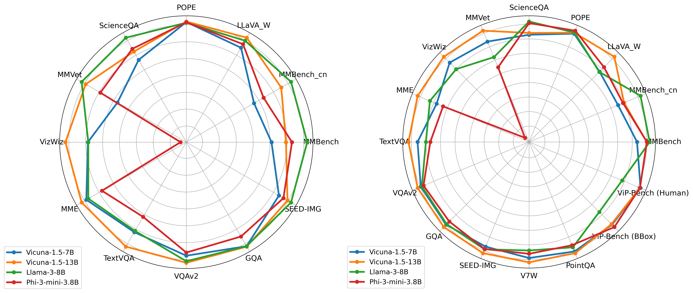

# Study on LLM Backbones

## Overview

This study investigates the impact of Large Language Model (LLM) backbones on both whole image-level and region-level vision-language benchmarks. We employ various models such as [Vicuna-1.5-7B](https://lmsys.org/blog/2023-03-30-vicuna/), Vicuna-1.5-13B, [Llama-3-8B](https://llama.meta.com/llama3/), and [Phi-3-mini-3.8B](https://arxiv.org/abs/2404.14219) as the language model backbone for both [LLaVA-1.5](https://arxiv.org/abs/2310.03744) and [ViP-LLaVA](https://arxiv.org/abs/2312.00784), keeping all other configurations and hyper-parameters consistent. 

<p align="center">

</p>

<p align="center">
Figure 1. Following the LLaVA-1.5 setting, we change the LLM backbone into Llama-3-8B, and Phi-3-mini-3.8B. They both show better language reasoning capability, such as in MMBench and ScienceQA.
</p>


## Benchmarking Datasets

We leverage diverse whole image-level and region-level tasks to benchmark different LLM backbones.

### Whole Image-Level Benchmarks

These benchmarks are derived from the official LLaVA-1.5 pipeline:
- [**MMB (MMBench)**](https://arxiv.org/abs/2307.06281)
- [**MMB-CN (MMBench-Chinese)**](https://arxiv.org/abs/2307.06281)
- [**LLaVA-W (LLaVA-Bench In-the-Wild)**](https://arxiv.org/abs/2304.08485)
- [**POPE**](https://arxiv.org/abs/2305.10355)
- [**SQA-I (ScienceQA-IMG)**](https://arxiv.org/abs/2209.09513)
- [**MM-Vet**](https://arxiv.org/abs/2308.02490)
- [**VisWiz**](https://arxiv.org/abs/1802.08218)
- [**MME**](https://arxiv.org/abs/2306.13394)
- [**VQA-T (TextVQA)**](https://arxiv.org/abs/1904.08920)
- [**VQA-v2**](https://arxiv.org/abs/1612.00837)
- [**GQA**](https://arxiv.org/abs/1902.09506)
- [**SEED-IMG (SEED-Bench-1 Image subset)**](https://arxiv.org/abs/2307.16125)

### Region-Level Benchmarks

Region-level benchmarks include:
- [**V7W (Visual7W)**](https://arxiv.org/abs/1511.03416)
- [**PointQA (PointQA-LookTwice)**](https://arxiv.org/abs/2011.13681)
- [**ViP-Bbox (ViP-Bench with tight bounding box condition)**](https://arxiv.org/abs/2312.00784)
- [**ViP-Human (ViP-Bench with human annotated visual prompts)**](https://arxiv.org/abs/2312.00784)


## Results

Results for these two types of LMMs, [LLaVA-1.5](https://arxiv.org/abs/2310.03744) and [ViP-LLaVA](https://arxiv.org/abs/2312.00784),  are displayed in the corresponding tables and radar plots linked below. The huggingface checkpoints are provided in the hyperlink.


|        Model         | MMBench | MMBench_cn | LLaVA_W | POPE | ScienceQA | MMVet | VizWiz |   MME  | TextVQA | VQAv2 |  GQA | SEED-IMG |
|:---------------:|:-------:|:----------:|:-------:|:----:|:---------:|:-----:|:------:|:------:|:-------:|:-----:|:----:|:--------:|
|  [Vicuna-1.5-7B](https://huggingface.co/liuhaotian/llava-v1.5-7b)  |   64.6  |    57.5    |   72.2  | 87.3 |    69.5   |  31.5 |  50.0  | 1506.5 |   58.2  |  78.3 | 63.2 | 66.2     |
| [Vicuna-1.5-13B](https://huggingface.co/liuhaotian/llava-v1.5-13b) |   67.7  |    63.6    |   **74.8**  | **87.4** |    71.6   |  35.4 |  **53.6**  | **1531.0** |   **61.3**  |  **80.0** | **63.3** | 68.2     |
|    [Llama-3-8B](https://huggingface.co/mucai/llava-1.5-llama-3-8b)   |   **72.3**  |    **65.8**    |   74.0  | 87.1 |    **75.2**   |  **35.9** |  50.0  | 1496.1 |   58.0  |  79.6 | 63.2 | **69.0**     |
|[Phi-3-mini-3.8B](https://huggingface.co/mucai/llava-1.5-phi-3-mini-3.8B) |   69.0  |    59.6    |   73.1  | 87.3 |    72.3   |  33.6 |  35.3  | 1424.5 |   55.0  |  77.6 | 61.1 | 67.3     |

<p align="center">
Table 1. Empirical Results of LLaVA-1.5 under different LLM backbone. 
</p>


|      Model           | MMBench | MMBench_cn | LLaVA_W | POPE | ScienceQA | MMVet | VizWiz |   MME  | TextVQA | VQAv2 |  GQA | SEED-IMG |  V7W | PointQA | ViP-Bench (BBox) | ViP-Bench (Human) |
|:---------------:|:-------:|:----------:|:-------:|:----:|:---------:|:-----:|:------:|:------:|:-------:|:-----:|:----:|:--------:|:----:|:-------:|:----------------:|:-----------------:|
|  [Vicuna-1.5-7B](https://huggingface.co/mucai/vip-llava-7b)  |   68.0  |    59.3    |   69.8  | 87.1 |    69.5   |  33.1 |  55.7  | 1453.5 |   57.8  |  79.2 | 62.2 | 69.0     | 86.6 |   71.3  |       48.4       |        **48.3**       |
|  [Vicuna-1.5-13B](https://huggingface.co/mucai/vip-llava-13b) |   70.3  |    60.7    |   **75.3**  | 87.4 |    70.0   |  **34.5** |  **57.4**  | **1564.0** |   **59.6**  |  **80.1** | **62.9** | **70.7**     | **87.9** |   **71.8**  |       48.3       |        48.2       |
|    [Llama-3-8B](https://huggingface.co/mucai/vip-llava-llama-3-8b)   |   **71.0**  |    **64.7**    |   69.7  | 87.5 |    **72.8**   |  31.1 |  53.9  | 1492.7 |   56.1  |  78.9 | 62.0 | 69.7     | 84.3 |   70.2  |       45.4       |        45.0       |
| [Phi-3-mini-3.8B](https://huggingface.co/mucai/vip-llava-phi-3-mini-3.8B) |   70.4  |    60.5    |   71.5  | **88.1** |    72.4   |  29.8 |  34.7  | 1416.2 |   55.2  |  78.4 | 61.2 | 69.6     | 85.3 |   69.6  |       **49.0**       |        48.2       |

<p align="center">
Table 2. Empirical Results of ViP-LLaVA under different LLM backbone. 
</p>

The overall charts are here:

<p align="center">

</p>


<p align="center">
Figure 2. Following the LLaVA-1.5 and ViP-LLaVA settings, we change the LLM backbone into Llama-3-8B, and Phi-3-mini-3.8B. Better language reasoning capability are observed. Yet tasks that require core visual understanding capability own similar performance. 
</p>


## Key Findings

- **Language and Commonsense Reasoning:** Recent LLMs, Llama-3 and Phi-3, *excel in tasks requiring language and commonsense reasoning*. Llama-3-8B and Phi-3-mini-3.8B outperform Vicuna-1.5-13B significantly in benchmarks such as MMBench and ScienceQA.
- **Visual vs. Language Capabilities:** Llama-3-8B and Phi-3-mini-3.8B *do not enhance performance significantly in tasks primarily requiring visual understanding*. Vicuna-1.5-13B still leads in benchmarks like MME, TextVQA, and GQA.
- **Zero-shot Vision-Language Tasks:** Phi-3-mini-3.8B shows limited effectiveness in zero-shot vision-language tasks like VizWiz, while performing comparably to Vicuna-1.5-7B in most other tasks.
- **Overall Performance:** Llama-3-8B generally performs better than Vicuna-1.5-7B and is on par with Vicuna-1.5-13B. Phi-3-mini-3.8B, however, underperforms Vicuna-1.5-13B on average.
- **Consistency in ViP-LLaVA:** ViP-LLaVA maintains performance consistency across various whole image understanding benchmarks when compared to LLaVA-1.5.

For detailed tables and radar charts, please refer to our [paper](https://arxiv.org/abs/2312.00784), which will appear in Supplementary Materials A.5.


## Training Scripts

### LLaVA-1.5

```python
## Llama-3

###pretrain
bash ./scripts/pretrain_llava_1_5_llama3.sh
###finetune
bash ./scripts/finetune_llava_1_5_llama3.sh

## Phi-3

###pretrain
bash ./scripts/pretrain_llava_1_5_phi3.sh
###finetune
bash ./scripts/finetune_llava_1_5_phi3.sh
```


### ViP-LLaVA

```python
## Llama-3

###pretrain
bash ./scripts/pretrain_vip_llava_llama3.sh
###finetune
bash ./scripts/finetune_vip_llava_llama3_stage2.sh
bash ./scripts/finetune_vip_llava_llama3_stage3.sh

## Phi-3

###pretrain
bash ./scripts/pretrain_vip_llava_phi3.sh
###finetune
bash ./scripts/finetune_vip_llava_phi3_stage2.sh
bash ./scripts/finetune_vip_llava_phi3_stage3.sh
```


## Evaluation Scripts
Please follow the instructions for [image-level benchmarks](https://github.com/WisconsinAIVision/ViP-LLaVA/blob/main/docs/Evaluation_image.md) and [object-level benchmarks](https://github.com/WisconsinAIVision/ViP-LLaVA/blob/main/docs/Evaluation.md).


## Citation


If you find our study on LLM backbone useful for your research and applications, please cite using this BibTeX:

```bibtex

@inproceedings{cai2024vipllava,
  author      = {Cai, Mu and Liu, Haotian and Mustikovela,  Siva Karthik and Meyer, Gregory P. and Chai, Yuning and Park, Dennis and Lee, Yong Jae},
  title       = {Making Large Multimodal Models Understand Arbitrary Visual Prompts},
  booktitle   = {IEEE Conference on Computer Vision and Pattern Recognition},
  year        = {2024}
}
```